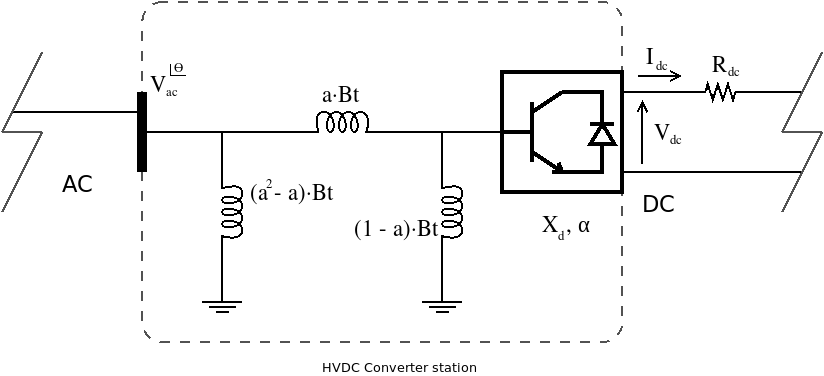

.. HVDC:

HVDC
========

This is the general model of an HVDC converter. In simulation terms it can be though of, as a very
special kind of node. This *special node* does convert AC power to DC power, and the general model
is this:

The controller basic parameters are:

- :math:`B_t`: Transformer susceptance.

- :math:`X_c`: Converter reactance.

The controller optional parameters depending on the control are:

- :math:`a^{sp}`: Specified transformer tap.

- :math:`P^{sp}_{dc}`: Specified DC power transport.

- :math:`V^{sp}_{dc}`: Specified DC voltage.

- :math:`I^{sp}_{dc}`: Specified DC current.

- :math:`\alpha^{sp}`: Specified firing angle. Turns into :math:`cos(\alpha^{sp})` for simplicity.

The controller has 4 unknowns + 1 unknown from the AC side. There are 3 equations R1, R2 and R3 that
define the controller, hence we need to impose another two equations. Therefore only two of these
optional parameters are used.

The controller unknowns are:

- :math:`V_{dc}`: DC-side voltage.

- :math:`I_{dc}`: DC-side current.

- :math:`a`: Converter station's transformer tap module.

- :math:`cos(\alpha)`: Cosine of the firing angle.

- :math:`\theta`: AC-side voltage angle.

Note that the only shared variable with the AC sistem is :math:`\theta`.

Controller equations:

.. math::

    R1: \quad  V_{dc} - k \cdot \frac{3 \sqrt 2}{\pi} \cdot a \cdot V \cdot cos(\theta)

    R2: \quad  V_{dc} - k \cdot \frac{3 \sqrt 2}{\pi} \cdot a \cdot V \cdot cos(\alpha) + \frac{3}{\pi} \cdot I_{dc} \cdot X_c

    R3: \quad  V_{dc} - I_{dc} \cdot R _{dc}

    R4: \quad Control \: equation \: 1

    R5: \quad Control \: equation \: 2

Now you may choose the controller equations 1 and 2 from the following pool of control equations:

Constant transformer tap:

.. math::

    a - a^{sp} = 0

Constant DC voltage:

.. math::

    V_{dc} - V_{dc}^{sp} = 0

Constant DC current:

.. math::

    I_{dc} - I_{dc}^{sp} = 0

Constant firing angle:

.. math::

    cos(\alpha) - cos({\alpha}^{sp}) = 0

Constant transported power:

.. math::

    V_{dc} \cdot I_{dc} - P_{dc}^{sp} = 0

Constant voltage module at the AC side. This makes sense if the AC side node is a PV node.

.. math::

    V - V^{sp} = 0

HVDC Power flow
---------------------

So, we have seen the equations of the controller. Now we need to assemble them into the Jacobian
for the Newton-Raphson algorithms.

Since this is a very long and error prone process due to the number of variables and functions
we will enumerate and derive each function separately. Prior to that it is useful to compute some generic derivatives.

Generic derivatives
^^^^^^^^^^^^^^^^^^^^^^^^

Given:

.. math::

    S^{ac} = V \cdot (Y \times V)^*

.. math::

    \frac{\partial S^{ac}}{\partial \theta} = j \cdot V_{diag} \times \left( I_{diag}^* - (Y \times V_{diag})^* \right)

    \frac{\partial S^{ac}}{\partial |V|} = V_{diag} \times \left( Y \times E_{diag})^* + I_{diag}^* \times E_diag

Given:

.. math::

    S^{dc} = V \cdot a \cdot I_d \cdot k \cdot \frac{3 \sqrt 2}{\pi}

.. math::

    \frac{\partial S^{dc}}{\partial \theta} = j V_{diag} \cdot a \cdot I_d \cdot k \cdot \frac{3 \sqrt 2}{\pi}

    \frac{\partial S^{dc}}{\partial |V|} = E_{diag} \cdot a \cdot I_d \cdot k \cdot \frac{3 \sqrt 2}{\pi}

    \frac{\partial S^{dc}}{\partial a} =  V \cdot I_d \cdot k \cdot \frac{3 \sqrt 2}{\pi}

    \frac{\partial S^{dc}}{\partial I_d} =  V \cdot a \cdot k \cdot \frac{3 \sqrt 2}{\pi}

f1
^^^^

.. math::

    f1: P^{ac} + P^{dc} = Re\left\{ V \cdot (Y \times V - I)^* \right\} + Re\left\{ V \cdot a \cdot I_d \cdot k \cdot \frac{3 \sqrt 2}{\pi} \right\}

    \Delta f1: P^{sp} - f1 = 0

    \frac{\partial f1}{\partial \theta} =

    \frac{\partial f1}{\partial |V|} =

    \frac{\partial f1}{\partial V_d} =

    \frac{\partial f1}{\partial I_d} =

    \frac{\partial f1}{\partial a} =

    \frac{\partial f1}{\partial cos(\alpha)} =

f2
^^^^

.. math::

    f1: Q^{ac} + Q^{dc} = Im\left\{ V \cdot (Y \times V - I)^* \right\} + Im\left\{ V \cdot a \cdot I_d \cdot k \cdot \frac{3 \sqrt 2}{\pi} \right\}

    \Delta f2: Q^{sp} - Q1 = 0

    \frac{\partial f2}{\partial \theta} =

    \frac{\partial f2}{\partial |V|} =

    \frac{\partial f2}{\partial V_d} =

    \frac{\partial f2}{\partial I_d} =

    \frac{\partial f2}{\partial a} =

    \frac{\partial f2}{\partial cos(\alpha)} =

f3
^^^^

.. math::

    f3: k \cdot \frac{3\sqrt 2}{\pi} \cdot a \cdot |V| \cdot cos(\theta)

    \Delta f3: V_d - f3 = 0

    \frac{\partial f3}{\partial \theta} =

    \frac{\partial f3}{\partial |V|} =

    \frac{\partial f3}{\partial V_d} =

    \frac{\partial f3}{\partial I_d} =

    \frac{\partial f3}{\partial a} =

    \frac{\partial f3}{\partial cos(\alpha)} =

f4
^^^^

.. math::

    f4: k \cdot \frac{3\sqrt 2}{\pi} \cdot a \cdot |V| \cdot cos(\alpha) + \frac{3}{\pi} \cdot I_d \cdot X_c

    \Delta f4: V_d - f4 = 0

    \frac{\partial f4}{\partial \theta} =

    \frac{\partial f4}{\partial |V|} =

    \frac{\partial f4}{\partial V_d} =

    \frac{\partial f4}{\partial I_d} =

    \frac{\partial f4}{\partial a} =

    \frac{\partial f4}{\partial cos(\alpha)} =

f5
^^^^

.. math::

    f5: I_d \cdot R_d

    \Delta f5: V_d - I_d \cdot R_d = 0

    \frac{\partial f5}{\partial \theta} = 0

    \frac{\partial f5}{\partial |V|} = 0

    \frac{\partial f5}{\partial V_d} =

    \frac{\partial f5}{\partial I_d} =

    \frac{\partial f5}{\partial a} =

    \frac{\partial f5}{\partial cos(\alpha)} =

f6
^^^^

.. math::

    f6: a

    \Delta f6: a^{sp} - a = 0

    \frac{\partial f6}{\partial \theta} = 0

    \frac{\partial f6}{\partial |V|} = 0

    \frac{\partial f6}{\partial V_d} = 0

    \frac{\partial f6}{\partial I_d} = 0

    \frac{\partial f6}{\partial a} = 1

    \frac{\partial f6}{\partial cos(\alpha)} = 0

f7
^^^^

.. math::

    f7: V_d

    \Delta f7: V_d^{sp} - V_d = 0

    \frac{\partial f7}{\partial \theta} = 0

    \frac{\partial f7}{\partial |V|} = 0

    \frac{\partial f7}{\partial V_d} = 1

    \frac{\partial f7}{\partial I_d} = 0

    \frac{\partial f7}{\partial a} = 0

    \frac{\partial f7}{\partial cos(\alpha)} = 0

f8
^^^^

.. math::

    f8: I_d

    \Delta f8: I_d^{sp} - I_d = 0

    \frac{\partial f8}{\partial \theta} = 0

    \frac{\partial f8}{\partial |V|} = 0

    \frac{\partial f8}{\partial V_d} = 0

    \frac{\partial f8}{\partial I_d} = 1

    \frac{\partial f8}{\partial a} = 0

    \frac{\partial f8}{\partial cos(\alpha)} = 0

f9
^^^^

.. math::

    f9: cos(\alpha)

    \Delta f9: cos(\alpha)^{sp} - cos(\alpha) = 0

    \frac{\partial f9}{\partial \theta} = 0

    \frac{\partial f9}{\partial |V|} = 0

    \frac{\partial f9}{\partial V_d} = 0

    \frac{\partial f9}{\partial I_d} = 0

    \frac{\partial f9}{\partial a} = 0

    \frac{\partial f9}{\partial cos(\alpha)} = 1

f10
^^^^

.. math::

    f10: V_d \cdot I_d

    \Delta f10: P_{dc}^{sp} - V_d \cdot I_d = 0

    \frac{\partial f10}{\partial \theta} = 0

    \frac{\partial f10}{\partial |V|} = 0

    \frac{\partial f10}{\partial V_d} = I_d

    \frac{\partial f10}{\partial I_d} = V_d

    \frac{\partial f10}{\partial a} = 0

    \frac{\partial f10}{\partial cos(\alpha)} = 0

Jacobian
^^^^^^^^^^^^

.. math::

    \begin{bmatrix}
    \frac{\partial f1}{\partial \theta} & \frac{\partial f1}{\partial |V|} & \frac{\partial f1}{\partial V_d} & \frac{\partial f1}{\partial I_d} & \frac{\partial f1}{\partial a} & \frac{\partial f1}{\partial cos(\alpha)} \\
    \frac{\partial f2}{\partial \theta} & \frac{\partial f2}{\partial |V|} & \frac{\partial f2}{\partial V_d} & \frac{\partial f2}{\partial I_d} & \frac{\partial f2}{\partial a} & \frac{\partial f2}{\partial cos(\alpha)}  \\
    \frac{\partial f3}{\partial \theta} & \frac{\partial f3}{\partial |V|} & \frac{\partial f3}{\partial V_d} & \frac{\partial f3}{\partial I_d} & \frac{\partial f3}{\partial a} & \frac{\partial f3}{\partial cos(\alpha)}  \\
    \frac{\partial f4}{\partial \theta} & \frac{\partial f4}{\partial |V|} & \frac{\partial f4}{\partial V_d} & \frac{\partial f4}{\partial I_d} & \frac{\partial f4}{\partial a} & \frac{\partial f4}{\partial cos(\alpha)} \\
    \frac{\partial f5}{\partial \theta} & \frac{\partial f5}{\partial |V|} & \frac{\partial f5}{\partial V_d} & \frac{\partial f5}{\partial I_d} & \frac{\partial f5}{\partial a} & \frac{\partial f5}{\partial cos(\alpha)}  \\
    \frac{\partial f6}{\partial \theta} & \frac{\partial f6}{\partial |V|} & \frac{\partial f6}{\partial V_d} & \frac{\partial f6}{\partial I_d} & \frac{\partial f6}{\partial a} & \frac{\partial f6}{\partial cos(\alpha)}  \\
    \frac{\partial f7}{\partial \theta} & \frac{\partial f7}{\partial |V|} & \frac{\partial f7}{\partial V_d} & \frac{\partial f7}{\partial I_d} & \frac{\partial f7}{\partial a} & \frac{\partial f7}{\partial cos(\alpha)} \\
    \frac{\partial f8}{\partial \theta} & \frac{\partial f8}{\partial |V|} & \frac{\partial f8}{\partial V_d} & \frac{\partial f8}{\partial I_d} & \frac{\partial f8}{\partial a} & \frac{\partial f8}{\partial cos(\alpha)}  \\
    \frac{\partial f9}{\partial \theta} & \frac{\partial f9}{\partial |V|} & \frac{\partial f9}{\partial V_d} & \frac{\partial f9}{\partial I_d} & \frac{\partial f9}{\partial a} & \frac{\partial f9}{\partial cos(\alpha)}  \\
    \frac{\partial f10}{\partial \theta} & \frac{\partial f10}{\partial |V|} & \frac{\partial f10}{\partial V_d} & \frac{\partial f10}{\partial I_d} & \frac{\partial f10}{\partial a} & \frac{\partial f10}{\partial cos(\alpha)}  \\
    \end{bmatrix}
    \times
    \begin{bmatrix}
    \Delta\theta_{pqpv|dc}\\
    \Delta |V|_{pq|dc}\\
    \Delta V_{d \: dc}\\
    \Delta I_{d \: dc}\\
    \Delta a_{dc}\\
    \Delta cos(\alpha)_{dc}\\
    \end{bmatrix}
    =
    \begin{bmatrix}
    \Delta f1_{pqpv|dc}\\
    \Delta f2_{pq|dc}\\
    \Delta f3_{dc}\\
    \Delta f4_{dc}\\
    \Delta f5_{dc}\\
    \Delta f6_{dc}\\
    \Delta f7_{dc}\\
    \Delta f8_{dc}\\
    \Delta f9_{dc}\\
    \Delta f10_{dc}\\
    \end{bmatrix}